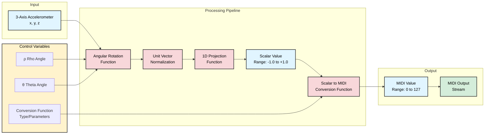

# Accelerometer Rotation Pipeline

## Overview

This feature replaces the current processing pipeline between incoming accelerometer data and the MIDI output stream. It transforms raw 3-axis accelerometer data through a series of mathematical operations to produce a single-dimensional output value suitable for MIDI control.

## Processing Pipeline



## Pipeline Stages

### Stage 1: Angular Rotation Function
**Inputs:**
- 3-axis accelerometer vector: `(x, y, z)`
- Control parameters:
  - `ρ` (Rho): Rotation angle around the X axis (0° - 360°)
  - `θ` (Theta): Rotation angle around the Y axis (0° - 360°)

**Function:**
Applies a 3D rotation transformation to the input accelerometer vector using the specified rotation angles. Rotations are applied in order: first around X axis (Rho), then around Y axis (Theta). This allows the orientation of the "sensing axis" to be dynamically adjusted.

**Output:**
- Rotated 3D vector: `(x', y', z')`

### Stage 2: Unit Vector Normalization
**Input:**
- Rotated vector: `(x', y', z')`

**Function:**
Normalizes the rotated vector to a unit vector (magnitude = 1.0), ensuring consistent scaling regardless of the actual acceleration magnitude.

**Output:**
- Normalized unit vector: `(x̂, ŷ, ẑ)` where `√(x̂² + ŷ² + ẑ²) = 1.0`

### Stage 3: 1D Projection Function
**Input:**
- Unit vector: `(x̂, ŷ, ẑ)`

**Function:**
Projects the 3D unit vector onto the X axis after rotation, extracting the x-component as the scalar value. This provides a single-dimensional representation of the rotated motion.

**Output:**
- Scalar value in range `[-1.0, +1.0]` (the x̂ component of the unit vector)

### Stage 4: Scalar to MIDI Conversion Function
**Input:**
- Scalar value: `[-1.0, +1.0]`
- Control parameters:
  - Conversion function type (linear, exponential, logarithmic, S-curve, custom)
  - Function parameters (slope, offset, exponent, breakpoints, etc.)

**Function:**
Applies a configurable mathematical or predefined function to map the normalized scalar value to MIDI control range. Available function types:

- **Linear**: `MIDI = clamp((scalar * scale + offset) * 127, 0, 127)`
  - Parameters: `scale` (-10.0 to -0.1 or 0.1 to 10.0), `offset` (-1.0 - 1.0)
  - Negative scale reverses output direction (127→0 instead of 0→127)
  - Storage: 2 floats (8 bytes)

- **Exponential**: `MIDI = clamp(((scalar + 1)/2)^exponent * 127, 0, 127)`
  - Parameters: `exponent` (0.1 - 5.0, where <1.0 = logarithmic feel, >1.0 = exponential feel)
  - Storage: 1 float (4 bytes)

- **S-Curve (Sigmoid)**: `MIDI = clamp(127 / (1 + e^(-steepness * scalar)), 0, 127)`
  - Parameters: `steepness` (1.0 - 20.0, controls curve sharpness)
  - Storage: 1 float (4 bytes)

- **Lookup Table**: 5-point piecewise linear interpolation
  - Parameters: 5 points defining input→output mapping at [-1.0, -0.5, 0.0, 0.5, 1.0]
  - Each point specifies output MIDI value [0, 127]
  - Linear interpolation between points
  - Storage: 5 uint8_t values (5 bytes)

**Output:**
- MIDI value in range `[0, 127]`

### Stage 5: MIDI Output
**Input:**
- MIDI value: `[0, 127]`
- MIDI CC number (configurable)

**Function:**
Packages the MIDI value into control change (CC) messages using the configured CC number and sends to the output stream via the existing serial communication interface.

**Output:**
- MIDI control messages sent to the existing serial stream

## Control Variables

| Variable | Symbol | Range | Default | Description |
|----------|--------|-------|---------|-------------|
| Rho Angle | ρ | 0° - 360° | 0° | Rotation angle around X axis |
| Theta Angle | θ | 0° - 360° | 0° | Rotation angle around Y axis |
| MIDI CC Number | - | 0 - 127 | 1 | Target MIDI control change number for output |
| Conversion Function | - | Enum | linear | Type of scalar-to-MIDI conversion (linear, exponential, scurve, lookup) |
| Function Parameters | - | Various | See below | Parameters specific to the selected conversion function |

**Default Function Parameters:**
- **Linear**: scale=1.0, offset=0.0 (direct mapping)
- **Exponential**: exponent=1.0 (neutral, linear response)
- **S-Curve**: steepness=5.0 (moderate curve)
- **Lookup**: [0, 32, 64, 96, 127] (linear distribution)

## Key Benefits

1. **Dynamic Orientation**: Users can adjust `ρ` and `θ` to map any physical motion direction to MIDI output
2. **Normalized Output**: Unit vector normalization ensures consistent behavior regardless of acceleration magnitude
3. **Simple Control Range**: Final 1D projection provides an intuitive [-1, +1] range for MIDI mapping
4. **Flexible Mapping**: The rotation approach allows mapping complex 3D motions to a single control dimension
5. **Customizable Response**: Conversion functions allow fine-tuning of control feel (linear, exponential, S-curve, custom)
6. **Musical Expression**: Non-linear curves enable more expressive control for musical performance
7. **Minimal Storage**: Entire configuration requires only 15 bytes maximum, enabling efficient storage and transmission
8. **Real-time Monitoring**: Pipeline monitoring enables live debugging and parameter tuning through external tools

## Implementation Considerations

- **Rotation Matrix**: Implement using standard 3D rotation matrices for X and Y axis rotations applied sequentially
- **Gimbal Lock**: Not a concern for X-Y rotation order, but document rotation sequence
- **Performance**: Optimize trigonometric calculations for real-time processing
- **Configuration**: Allow runtime adjustment of `ρ`, `θ`, MIDI CC number, and conversion function parameters via configuration commands
- **Calibration**: Provide calibration mode to help users find optimal rotation angles
- **Function Library**: Implement a library of common conversion functions with optimized implementations
- **Lookup Tables**: Pre-compute expensive functions (exp, log) into lookup tables for real-time performance
- **Parameter Validation**: Validate all parameters; reject invalid values with warning message and retain last valid settings
- **Serial Stream Integration**: Utilize the existing serial communication stream for MIDI output, maintaining compatibility with current system architecture
- **Replacement Strategy**: This pipeline is a mandatory replacement of the existing `accel_mapping.c` functionality. Existing deadzone code should be preserved (commented or in separate file) but not active in this pipeline.
- **Error Handling**: Log warning messages for invalid parameter attempts. System must always maintain last valid configuration when invalid parameters are applied.
- **Pipeline Monitoring**: Implement toggleable monitoring output for debugging and external GUI integration. Use efficient formatting (tab-delimited) and rate limiting to minimize performance impact.

## CLI Commands and Configuration

### Pipeline Configuration Command

The rotation pipeline should be configurable through a single CLI command that accepts all parameters:

```
accel_pipeline <rho> <theta> <midi_cc> <func_type> [func_params...]
```

**Parameters:**
- `<rho>`: Rho rotation angle around X axis (0-360 degrees)
- `<theta>`: Theta rotation angle around Y axis (0-360 degrees)
- `<midi_cc>`: MIDI CC number for output (0-127)
- `<func_type>`: Conversion function type (linear, exponential, scurve, lookup)
- `[func_params...]`: Function-specific parameters (varies by function type)

**Example Usage:**
```
accel_pipeline 45 90 1 linear 1.0 0.5          # Rho=45°, Theta=90°, CC=1, Linear: scale=1.0, offset=0.5
accel_pipeline 45 90 1 linear -1.0 0.0         # Same rotation, reversed output (127→0 instead of 0→127)
accel_pipeline 30 60 7 exponential 2.0         # Rho=30°, Theta=60°, CC=7, Exponential: exponent=2.0
accel_pipeline 0 180 11 scurve 10.0            # Rho=0°, Theta=180°, CC=11, S-curve: steepness=10.0
accel_pipeline 15 45 74 lookup 0 20 64 108 127 # Rho=15°, Theta=45°, CC=74, Lookup: 5 output values
```

**Parameter Details by Function Type:**
- **linear**: `<scale> <offset>` (2 parameters)  - scale: -10.0 to -0.1 or 0.1 to 10.0 (negative reverses direction)
  - offset: -1.0 to 1.0- **exponential**: `<exponent>` (1 parameter)
- **scurve**: `<steepness>` (1 parameter)
- **lookup**: `<out0> <out1> <out2> <out3> <out4>` (5 parameters, MIDI values 0-127)

### Pipeline Monitor Command

For debugging and external GUI monitoring, a command to dump intermediate pipeline values in real-time:

```
accel_pipeline_monitor [enable|disable|once]
```

**Modes:**
- `enable`: Continuously output pipeline state (every acceleration data update)
- `disable`: Stop monitoring output
- `once`: Output current pipeline state once

**Output Format:**

Compact, tab-delimited format for fast parsing and minimal overhead:

```
APM <timestamp_ms> <ax> <ay> <az> <rx> <ry> <rz> <nx> <ny> <nz> <scalar> <midi_val> <midi_cc> <func_type>
```

**Field Descriptions:**
- `APM` - Fixed prefix for easy parsing ("Accelerometer Pipeline Monitor")
- `<timestamp_ms>` - System timestamp in milliseconds
- `<ax> <ay> <az>` - Raw accelerometer input (milli-g)
- `<rx> <ry> <rz>` - After rotation (float, g units)
- `<nx> <ny> <nz>` - After normalization (unit vector)
- `<scalar>` - 1D projection value (-1.0 to +1.0)
- `<midi_val>` - Final MIDI output value (0-127)
- `<midi_cc>` - MIDI CC number used
- `<func_type>` - Conversion function type (0=linear, 1=exponential, 2=scurve, 3=lookup)

**Example Output:**
```
APM 12345 -500 200 980 -0.35 0.14 0.85 -0.38 0.15 0.91 -0.38 31 1 0
APM 12350 -520 210 975 -0.36 0.15 0.84 -0.39 0.16 0.91 -0.39 30 1 0
APM 12355 -510 205 982 -0.35 0.14 0.85 -0.38 0.15 0.92 -0.38 31 1 0
```

**Parsing Recommendations:**
- Split on whitespace or tabs
- First field is always "APM" (validate)
- All numeric fields after timestamp are fixed-position
- High-frequency updates possible (100+ Hz typical)
- External GUI should throttle display updates as needed

**Use Cases:**
1. **Parameter Tuning**: Observe how rotation angles affect the output in real-time
2. **Curve Visualization**: See scalar-to-MIDI conversion behavior with different functions
3. **Debugging**: Identify issues in rotation, normalization, or conversion stages
4. **External GUI**: Feed data to visualization tools for graphical parameter adjustment
5. **Performance Analysis**: Monitor pipeline behavior under different motion patterns

**Implementation Notes:**
- Monitor output should be toggleable to avoid performance impact when not needed
- Consider rate limiting (e.g., max 100 Hz) to prevent overwhelming serial buffer
- Buffer output should not block MIDI transmission
- Prefix "APM" allows easy filtering from other log/debug messages

### JSON Configuration

**Important**: When implementing JSON-based configuration (import/export), all rotation pipeline settings must be included in the JSON data structure. This includes:

- Rho angle (ρ)
- Theta angle (θ)
- Conversion function type
- All function-specific parameters

This ensures complete configuration portability and allows users to save, share, and restore pipeline configurations as part of the overall system configuration.

**Example JSON Structure:**
```json
{
  "accel_rotation_pipeline": {
    "rho_angle": 45.0,
    "theta_angle": 90.0,
    "midi_cc": 1,
    "conversion_function": {
      "type": "linear",
      "parameters": {
        "scale": 1.0,
        "offset": 0.5
      }
    }
  }
}
```

**Alternative function examples:**
```json
// Exponential
"conversion_function": {
  "type": "exponential",
  "parameters": { "exponent": 2.0 }
}

// S-Curve
"conversion_function": {
  "type": "scurve",
  "parameters": { "steepness": 10.0 }
}

// Lookup Table
"conversion_function": {
  "type": "lookup",
  "parameters": { "points": [0, 20, 64, 108, 127] }
}
```

**Configuration Storage Requirements:**
- Rho angle: 4 bytes (float)
- Theta angle: 4 bytes (float)
- MIDI CC: 1 byte (uint8_t)
- Function type: 1 byte (enum)
- Function parameters: 5 bytes max (lookup table with 5 uint8_t values)
- **Total: 15 bytes maximum per pipeline configuration**

## Open Issues and Design Decisions Needed

### Configuration Storage
- ✅ **RESOLVED**: Function definitions use minimal storage (1-5 parameters, max 15 bytes total)
- ✅ **RESOLVED**: 5-point lookup table with linear interpolation for custom curves

### Remaining Open Issues

1. **Migration and Compatibility**
   - **ISSUE**: Migration path from existing `accel_mapping.c` configurations not defined
   - **ISSUE**: How to handle existing stored configurations during upgrade?
   - **ISSUE**: Should there be a one-time conversion utility or manual reconfiguration?

2. **Lookup Table Input Points**
   - **Decision Made**: Fixed input points at [-1.0, -0.5, 0.0, 0.5, 1.0]
   - **Alternative**: Could allow configurable input points (requires 10 bytes instead of 5)
   - **Recommendation**: Start with fixed input points for simplicity, add configurable if needed later

## Related Files

- `src/accel_mapping.c` - Current accelerometer mapping implementation (rotation pipeline)
- `src/accel_mapping.h` - Pipeline data structures and function prototypes
- `src/midi_logic.c` - MIDI output logic
- `src/ui_interface_shell.c` - CLI command implementations (config and monitor commands)
- `CONFIG_STORAGE.md` - Configuration parameter storage
